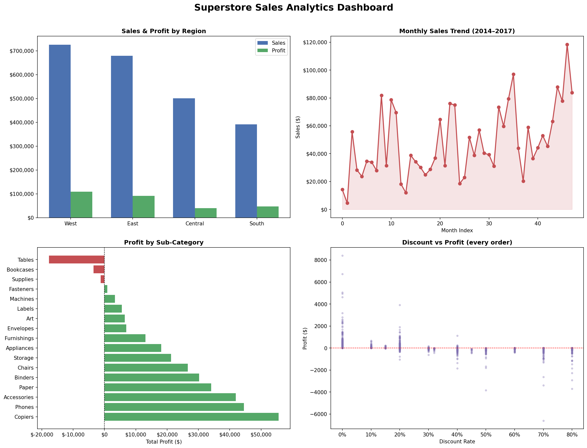

# 📊 Sales Analytics Dashboard

## 📌 Project Overview

This project demonstrates an **end-to-end sales analytics workflow** using **Python, data processing, and Power BI visualization**.
The goal is to analyze sales performance, identify key trends, and generate business insights that can support data-driven decision-making.

---

## 🛠 Tools & Technologies

* Python (Pandas, NumPy)
* Jupyter Notebook
* Power BI
* Data Visualization
* CSV Data Processing

---

## 📂 Project Structure

```
sales-analytics-dashboard
│
├── sales_analysis.ipynb        # Python analysis notebook
├── Sample - Superstore.csv     # Raw dataset
├── superstore_clean.csv        # Cleaned dataset
├── monthly_trend.csv           # Monthly sales analysis
├── regional_summary.csv        # Regional performance summary
├── Superstore_Dashboard.pbix   # Power BI dashboard
├── dashboard.png               # Dashboard preview
└── README.md
```

---

## 📊 Key Analysis Performed

* Data cleaning and preprocessing
* Sales trend analysis by month
* Regional sales performance comparison
* Data preparation for visualization
* Dashboard creation for business insights

---

## 📈 Key Insights

* Identified top-performing regions based on revenue.
* Analyzed monthly sales trends to detect seasonal patterns.
* Visualized key metrics such as **total sales, profit, and order distribution**.

---

## 📷 Dashboard Preview



---

## 🚀 How to Run the Project

1. Clone the repository

```
git clone https://github.com/Vanshika3881/sales-analytics-dashboard.git
```

2. Open the notebook

```
sales_analysis.ipynb
```

3. Run the Python analysis to generate processed datasets.

4. Open **Superstore_Dashboard.pbix** in Power BI to explore the dashboard.

---

## 📚 Dataset

The dataset used is the **Superstore Sales Dataset**, commonly used for sales analytics and business intelligence projects.

---

## 👩‍💻 Author

**Vanshika**

Data Analytics | Python | SQL | Power BI
